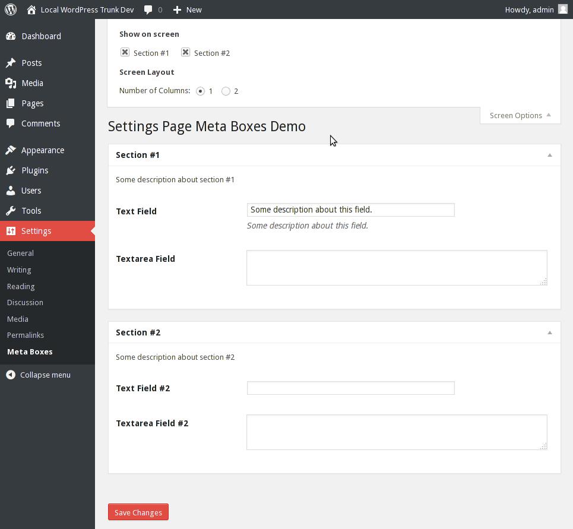

<!-- DO NOT EDIT THIS FILE; it is auto-generated from readme.txt -->
# Settings Page Meta Boxes

A helper class to easily create custom meta boxes on plugin/theme settings page.

**Contributors:** [kucrut](http://profiles.wordpress.org/kucrut)  
**Tags:** [settings](http://wordpress.org/plugins/tags/settings), [meta-box](http://wordpress.org/plugins/tags/meta-box)  
**Requires at least:** 3.8  
**Tested up to:** 3.9-RC1  
**Stable tag:** 0.1.0  
**License:** [GPLv2](http://www.gnu.org/licenses/gpl-2.0.html)  
**Donate Link:** http://kucrut.org/#coffee  

## Description ##

### Usage ###
See `settings-meta-boxes-demo.php`.

Development of this plugin is done on [GitHub](https://github.com/kucrut/wp-settings-meta-boxes). **Pull requests welcome**. Please see [issues reported](https://github.com/kucrut/wp-settings-meta-boxes/issues) there before going to the plugin forum.

## Screenshots ##

### Settings Page with Meta Boxes

## Installation ##

1. Upload `settings-meta-boxes` to the `/wp-content/plugins/` directory
1. Activate the plugin through the *Plugins* menu in WordPress

or...

1. Drop settings-meta-boxes.php into `/wp-content/mu-plugins/` directory

## Changelog ##

### 0.1.0 ###
* Initial public release

